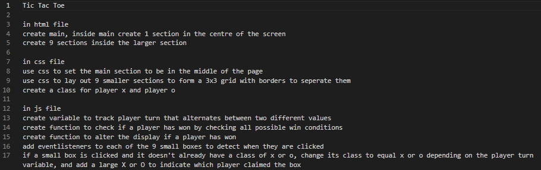

# TicTacToe
A simple TicTacToe game for people to enjoy.

## :computer: [Click here](#) to see my live project!

## :page_facing_up: About
- A TicTacToe game where you take turns clicking in the game interface to try and get 3 in a row to win

## :pencil2: Planning & Problem Solving
- initially make pseudocode to work through the app functionality and how to make it work

- set up a baseplate page for it to work on with a simple playing grid
- Struggled to code in a way to prevent the user/s from adding more X's or O's after one player had won, initially thought to remove the on-click functionality, but ended up resolving the issue by implementing code that prevented the on-click from running if a player had won

## :rocket: Cool tech
- created with html, css and javascript
- once a player wins it is announced on the page
- more to be added as features are introduced

## :beetle: Bugs to fix
- No current bugs in the program that I have discovered

## :notebook: Lessons learnt
- instead of trying to remove code to fix a bug, I learned to instead find a way to make it not run

## :white_check_mark: Future Features
- win counters for both X and O players
- a reset button to clear the current play field
- a new game button to clear the play field and reset the win counters